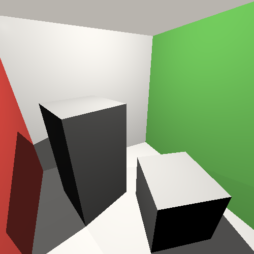
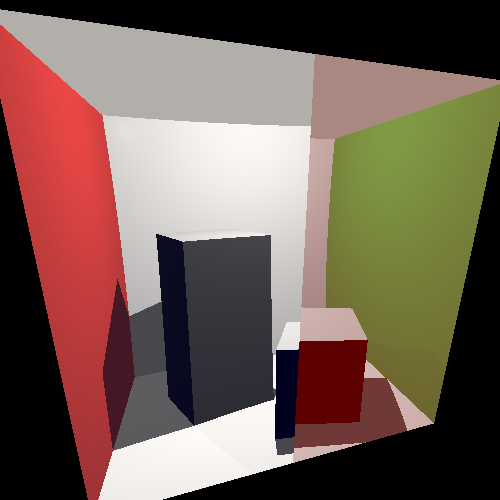
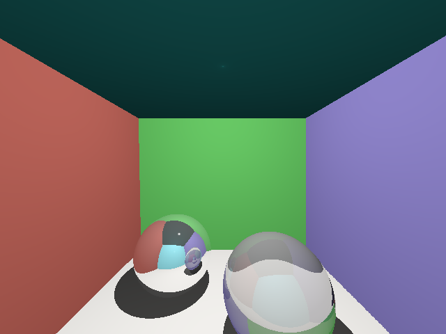

# Raytracer

Простой рейтрейсер, отрисовывающий сцены, состоящие из таких примитивов как
треугольники и сферы.

Сцена считывается из .obj файлов с заданием материалов в .mtl
Используется Phong reflection model, и возможность задавать прозрачность,
    степень приломления и отражения у материалов.

## Простые геометрические формы

    ____
## Сферы + зеркала

    ____
## Преломление лучей

    ____
## Преломляющая и отражающая сфера

